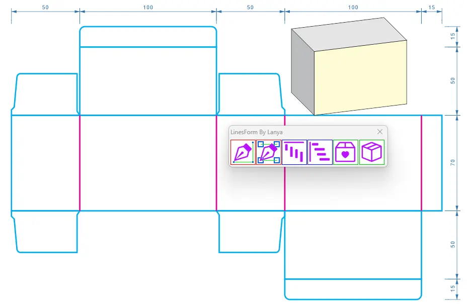
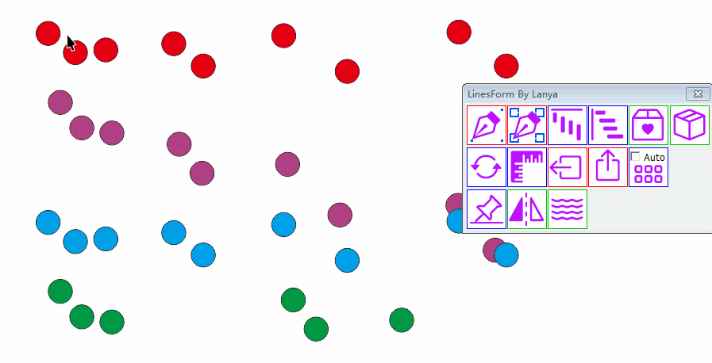
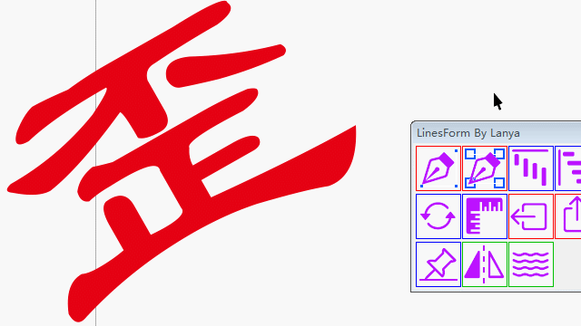
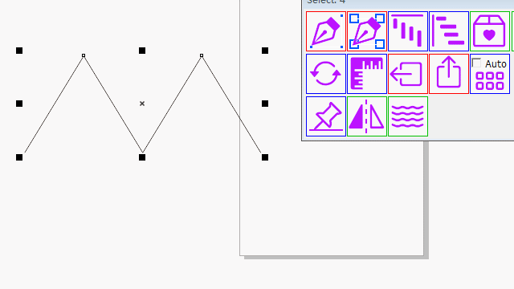

# vbabox

## 兰雅VBA 线段简易包装盒插件  [`Lanya_LinesTool.zip`](https://lyvba.com/Lanya_LinesTool.zip) [GMS下载](https://lyvba.com/Lanya_LinesTool.zip)


## 功能介绍
- 1.选择多个物件的多个节点，点击第一个图标连接成多线段
- 2.选择多个物件，鼠标左右键加Ctrl，可以不同的排序分别连接多组物件的中心点
- 3.选择多个物件，按从左到右按顶对齐，鼠标左右键加Ctrl控制物件的间距
- 4.选择多个物件，按从上到下按左对齐，鼠标左右键加Ctrl控制物件的间距
- 5.兰雅VBA 线段简易包装盒插件，鼠标左右键加Ctrl，目前有三种样式(如图)
- 6.选择盒子的顶正侧三面，点击生成简易的3D变形效果
- 7.2023年9月更新功能: 添加批量旋转移动 镜像 自动间距 转平功能

### github开源网址: https://github.com/hongwenjun/vbabox
### 兰雅VBA 线段简易包装盒插件 [免费开源下载](https://lyvba.com/Lanya_LinesTool.zip)

## 功能演示
- 绘制易包装盒


- 镜像功能


- 物件自动中心间距


- 物件转水平


- 平线线功能


----
## CorelDRAW VBA 插件 简易的长宽高盒子插件和源码和步骤原理

- https://www.bilibili.com/video/BV1MF411f7qu/

### 前两天在本论坛看到网友，问怎么绘制如下图简单的封套盒子。所以有了思路，就动手写了代码


```bas
Public Function Simple_box_one()
  ActiveDocument.Unit = cdrMillimeter
  l = 100: w = 50: h = 70: b = 15
  boxL = 2 * l + 2 * w + b
  boxH = h
  l1x = w
  l2x = w + l
  l3x = 2 * w + l
  l4x = 2 * (w + l)
  
  Set Rect = ActiveLayer.CreateRectangle(0, 0, boxL, boxH)
  Set sl1 = DrawLine(l1x, 0, l1x, h)
  Set sl2 = DrawLine(l2x, 0, l2x, h)
  Set sl3 = DrawLine(l3x, 0, l3x, h)
  Set sl4 = DrawLine(l4x, 0, l4x, h)
End Function
```

### 代码中的公式，不用初中知识应该就可以理解的。就是计算矩形多大，绘制4条线，把线移动到正确的位置


```bas
Public Function Simple_box_two()
  ActiveDocument.Unit = cdrMillimeter
  l = 100: w = 50: h = 70: b = 15
  boxL = 2 * l + 2 * w + b: boxH = h
  l1x = w: l2x = w + l: l3x = 2 * w + l: l4x = 2 * (w + l)
  
  Set mainRect = ActiveLayer.CreateRectangle(0, 0, boxL, boxH)
  
  Set topRect = ActiveLayer.CreateRectangle(0, 0, l, w)
  topRect.Move l1x, h
  Set bottomRect = ActiveLayer.CreateRectangle(0, 0, l, w)
  bottomRect.Move l3x, -w
  
  Set sl1 = DrawLine(l1x, 0, l1x, h)
  Set sl2 = DrawLine(l2x, 0, l2x, h)
  Set sl3 = DrawLine(l3x, 0, l3x, h)
  Set sl4 = DrawLine(l4x, 0, l4x, h)
End Function
```

### 绘制线条的代码写成函数调用，可以设置颜色或者粗细
```bas
'// 画一条线，设置轮廓色 M100
Private Function DrawLine(X1, Y1, X2, Y2) As Shape
  Set DrawLine = ActiveLayer.CreateLineSegment(X1, Y1, X2, Y2)
  DrawLine.Outline.SetProperties Color:=CreateCMYKColor(0, 100, 0, 0)
End Function
```


## 圆角插口和翅膀的代码

- 建立圆角矩形函数 `CreateRectangle(0, 0, l, b, 50, 50)` ，第5-6参数，指定上2圆角的系数
- 翅膀是个自定义多节点曲线，先用矩形函数，绘制一个临时物件 `s` 确定范围大小
- 然后定义 `DrawWing(s As Shape)` 函数来手工绘制，如图
- `sp.AppendLineSegment 4, y - 2.5`  '// 绘制直线
- `sp.AppendCurveSegment2 6.5, y, 4.1, y - 1.25, 5.1, y`  '// 绘制曲线

### 绘制整个盒子完整的代码
https://github.com/hongwenjun/vbabox/blob/main/Box.bas

### 最后在窗口控间中添加一个图片当按钮
```vbs
Private Sub MakeBox_Click()
  box.Simple_box_three
End Sub
```
